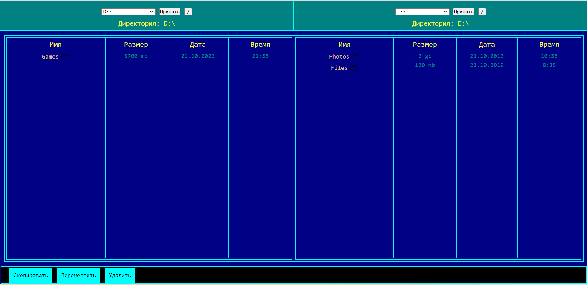

# Vue_Rostelecom_Test

## Файловый менеджер (визуальная копия norton commander)

*Проект не закончен. Данный проект выполняет основные функции файлового менеджера, просмотр файлов и каталогов и совершать действия над ними.
Серверная часть написана на Node.js базовый фрейсворк express.js, база данных MongoDB. Пользовательская часть написана на чистом Vue, в проекте не допускалось
использовать стороние библиотеки и зависимости. Данный факт стал причиной недеспособности проекта. Без стейт менеджера проект перегружен эмитами и прокидыванием 
пропсов.

## Хостинг

Проект развернут на площадке google Firebase и Heroku

Клиентская часть: https://vue-rostelecom.web.app/

Серверная часть: https://vuerostelecom.herokuapp.com   
Репозитрий: https://github.com/utkamag/Vue_Rostelecom_Backend

## Технологический стек
Frontend:
- Vue.js

Backend:
-Node.js
-Express.js
- MongoDB
- Mongoose
